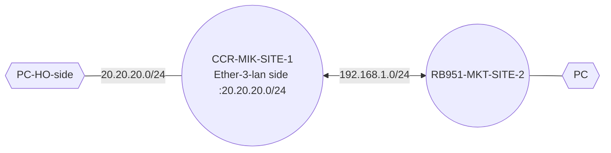

# MTCRE
 ## EOIP VPN:

- Step 1: IP config in CCR-MKT 
- 
- Step 2: Ip config in RB951-MKT
- 
- Step 3: Create Interface for EoIP in CCR
  - Interface > EoIP > ADD > m
  - Remote IP. (192.168.1.2/24)
  - Self LAN interface MAC (internal)-eth3 mac address 
  -   - tunnel id = 1
  - 

- Step 4: Bridge the Lan port and EoIP and Created the DHCP server in Bridge port.
   
   
- Step 5:  

