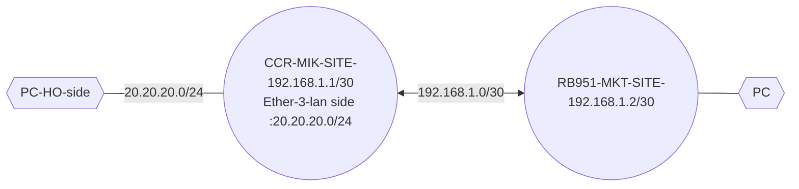

# MTCRE
 ## EOIP VPN:

### Step 1: IP config in CCR-MKT 
- 
###Step 2: Ip config in RB951-MKT
- 
### Step 3: Create Interface for EoIP in CCR
  - Interface > EoIP > ADD > m
  - Remote IP. (192.168.1.1/24)
  - Self LAN interface MAC (internal)-eth3 mac address 
  -   - tunnel id = 1
  - 

### Step 4: Bridge the Lan port and EoIP and Created the DHCP server in Bridge port.
   
   
   ### Step 5: Do same in RB951 but do not create the DHCP server as the LAN will get ip from CCR.

---
---
---

  ## IPIP VPN:
```mermaid
graph LR
PC1{{PC-HO-side}}---|20.20.20.0/24|Mikrotik1((CCR-MIK-SITE-192.168.1.1/30<br>IPIPtunnel-10.10.10.1/30<br>Ether-3-lan side :20.20.20.0/24))<-->|P2P-192.168.1.0/30<br>IPIP tunnel: 10.10.10.0/30|Mikrotik2((RB951-MKT-SITE-192.168.1.2/30<br>IPIP tunnel-10.10.10.2/30<br>Lan network:30.30.30.0/24))---PC{{PC-Koshi-Branch}}
  ```
### Step 1 : Config the P2P and Lan network in both end.
### Step 2: Config IPIP Tunnel in CCR and RB951.


### Step 3: Assign IP address to IPIP tunnel interface.


### Step 4: Add Static route in both router.
  
  


