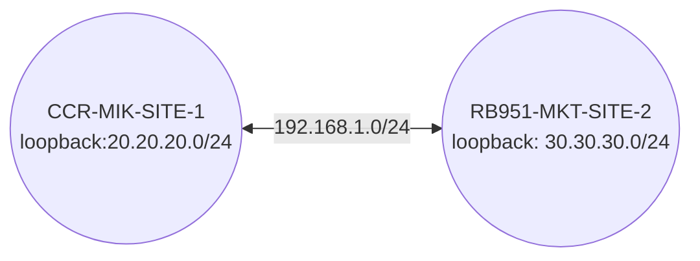

# MTCRE
## SITE TO  SITE VPN
 ### EOIP VPN:

```mermaid
graph LR
Mikrotik1((CCR-MIK-SITE-1<br>loopback:20.20.20.0/24))<-->|192.168.1.0/24|Mikrotik2((RB951-MKT-SITE-2<br>loopback: 30.30.30.0/24))
```
- ***Consider loopback as LAN network**
- Step 1: IP config in CCR-MKT
- 
- Step 2: Ip config in RB951-MKT
- 
- 

